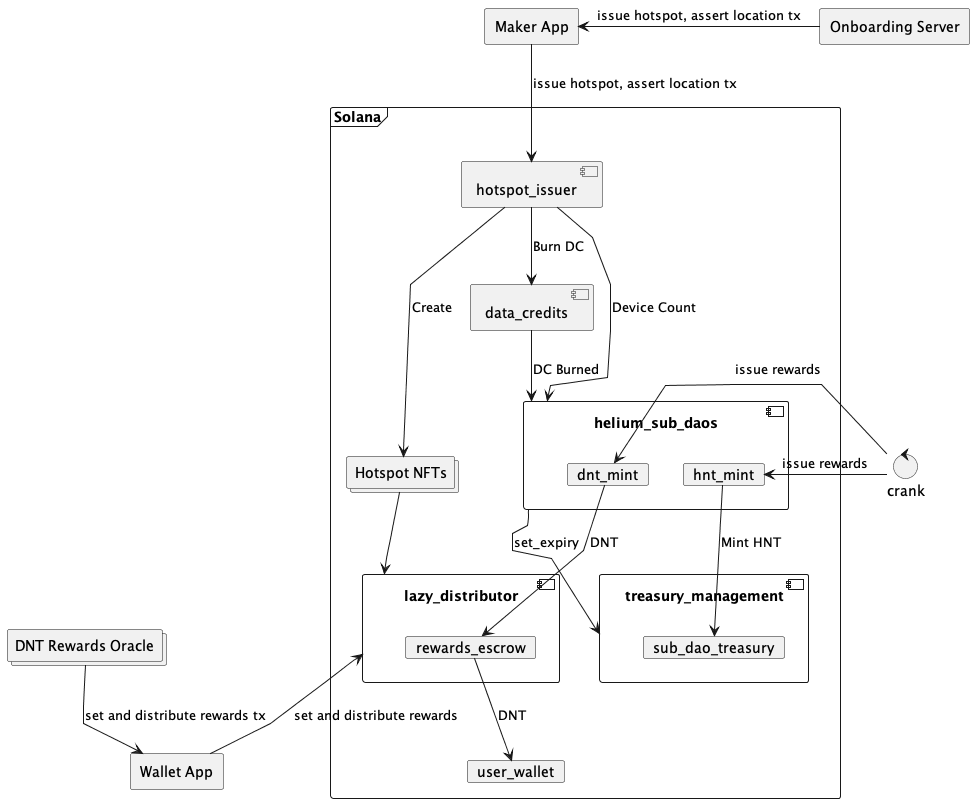

# Helium Program Library

A collection of solana programs used for Helium's Solana integration


## Overall Design




## Helium Sub Daos

Helium Sub Daos manages the daos and rewards structure of the Helium ecosystem. Other programs in the ecosystem
are expected to call out to helium sub daos to update rewardable actions, like issuing a new hotspot and burning
data credits

## Data Credits

Data credits manages the soulbound helium data credits, and how they can be burned to do several actions on the network. It also manages reading from an oracle to allow burning HNT for data credits

## Hotspot Issuance

Hotspot issuance is responsible for issuing the various types of hotspots that Helium supports (wifi, iot, mobile, etc)


## Lazy Distributor

The lazy distributor is an oracle-powered token distributor that distributes tokens to holders
of particular NFTs as specified by oracles.


### Oracle Architecture

In order to facilitate setting rewards _and_ distributing rewards in a single Solana transaction,
I propose at the url specified in the oracle configuration, supporting `GET` and `POST` 

#### GET Request

Request current rewards for the hotspot. Provide `?mint=...` query param with the hotspot mint.

Which should return

```
{
  "currentRewards": ...
}
```

#### POST Request

Sign transaction to set rewards and distribute
```
{
  transaction: ... // serialized transaction
}
```

Which should return

```
{
  transaction: ... // signed transaction
}
```

Before signing the transaction, the oracle should validate (1) that the transaction contains only

  * `setCurrentRewards` instructions from other validators
  * distribute instructions

and (2) that the amount set for `setCurrentRewards` for itself is correct.


#### Client Side

The client should:

  * Submit requests to all oracles to get the current total rewards amount
  * Form instructions to set rewards from all oracles using their specified rewards amount
  * Submit a sign transaction request to all oracles sequentially
  * Submit the signed transaction to Solana
