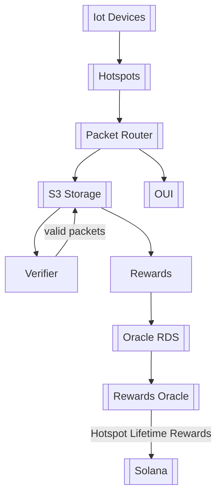
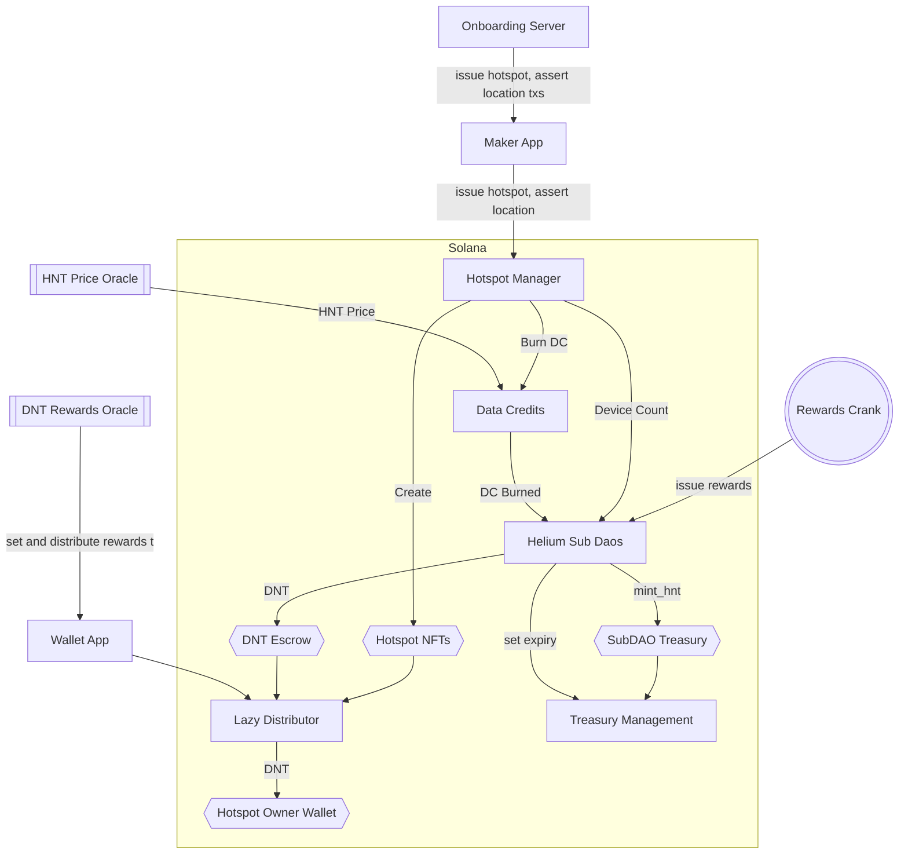
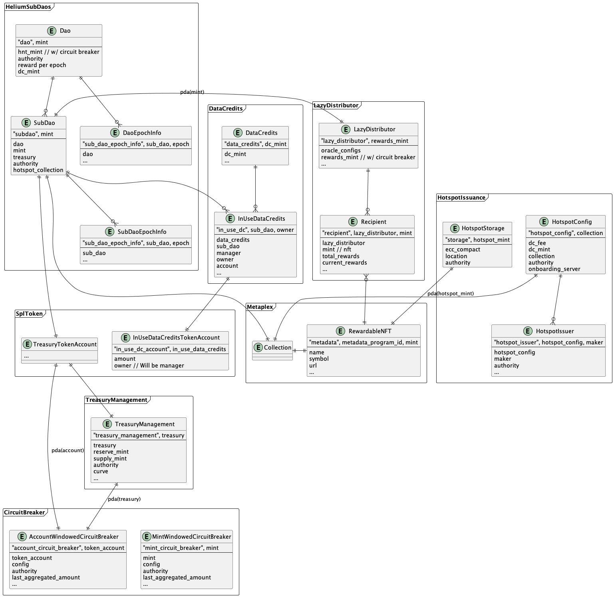

# Helium Program Library

A collection of solana programs used for Helium's Solana integration


## Overall Design



```mermaid
flowchart TD
  hotspot[[Hotspots]]
  ingest[[Packet Router]]
  s3[[S3 Storage]]
  verify[Verifier]
  rewards[Rewards]
  oracle_rds[[Oracle RDS]]
  rewards_oracle[[Rewards Oracle]]
  solana[[Solana]]
  oui[[OUI]]
  iot[[Iot Devices]]


  hotspot --> ingest
  ingest --> s3
  s3 --> verify
  verify --valid packets--> s3
  s3 --> rewards
  rewards --> oracle_rds
  oracle_rds --> rewards_oracle
  rewards_oracle --Hotspot Lifetime Rewards--> solana
  ingest --> oui
  iot --> hotspot
```


```mermaid
flowchart TD
  maker[Maker App]
  onboarding[Onboarding Server]
  crank(((Rewards Crank)))
  hnt_price_oracle[[HNT Price Oracle]]
  oracles[[DNT Rewards Oracle]]
  wallet_app[Wallet App]

  oracles --set and distribute rewards tx--> wallet_app
  wallet_app --> lazy_distributor
  subgraph Solana
    manager[Hotspot Manager]
    data_credits[Data Credits]
    dnt_rewards_escrow{{DNT Escrow}}
    hotspots{{Hotspot NFTs}}
    helium_sub_daos[Helium Sub Daos]
    lazy_distributor[Lazy Distributor]
    treasury_management[Treasury Management]
    user_wallet{{Hotspot Owner Wallet}}
    treasury{{SubDAO Treasury}}
  end

  data_credits --DC Burned--> helium_sub_daos

  onboarding --issue hotspot, assert location txs--> maker
  maker --issue hotspot, assert location--> manager

  hnt_price_oracle --HNT Price--> data_credits
  dnt_rewards_escrow --> lazy_distributor

  manager --Burn DC--> data_credits
  manager --Create--> hotspots
  manager --Device Count--> helium_sub_daos


  crank --issue rewards--> helium_sub_daos
  helium_sub_daos --DNT--> dnt_rewards_escrow
  helium_sub_daos --set expiry--> treasury_management
  helium_sub_daos --mint_hnt--> treasury
  treasury -->  treasury_management

  hotspots --> lazy_distributor
  lazy_distributor --DNT--> user_wallet

```



## Helium Sub Daos

Helium Sub Daos manages the daos and rewards structure of the Helium ecosystem. Other programs in the ecosystem
are expected to call out to helium sub daos to update rewardable actions, like issuing a new hotspot and burning
data credits

## Data Credits

Data credits manages the soulbound helium data credits, and how they can be burned to do several actions on the network. It also manages reading from an oracle to allow burning HNT for data credits

## Helium Entity Manager

Helium Entity Manager is responsible for issuing the various types of hotspots and rewardable entities that Helium supports (wifi, iot, mobile hotspots, mobile mappers, etc)


## Lazy Distributor

The lazy distributor is an oracle-powered token distributor that distributes tokens to holders
of particular NFTs as specified by oracles.


### Oracle Architecture

In order to facilitate setting rewards _and_ distributing rewards in a single Solana transaction,
I propose at the url specified in the oracle configuration, supporting `GET` and `POST`

#### GET Request

Request current rewards for the hotspot. Provide `?mint=...` query param with the hotspot mint.

Which should return

```
{
  "currentRewards": ...
}
```

#### POST Request

Sign transaction to set rewards and distribute
```
{
  transaction: ... // serialized transaction
}
```

Which should return

```
{
  transaction: ... // signed transaction
}
```

Before signing the transaction, the oracle should validate (1) that the transaction contains only

  * `setCurrentRewards` instructions from other validators
  * distribute instructions

and (2) that the amount set for `setCurrentRewards` for itself is correct.


#### Client Side

The client should:

  * Submit requests to all oracles to get the current total rewards amount
  * Form instructions to set rewards from all oracles using their specified rewards amount
  * Submit a sign transaction request to all oracles sequentially
  * Submit the signed transaction to Solana


## Local Setup

1. Make sure you're using Node 22+ and have pnpm installed via corepack

```
corepack enable
```

2. Install dependencies

```
pnpm install
```

3. Build all packages

```
pnpm run build
```

4. Start localnet

```
$: TESTING=true anchor localnet
```

5. Bootstrap localnet

```
$: . ./scripts/bootstrap-localnet.sh
```

6. Run tests against localnet

```
$: anchor test --provider.cluster localnet --skip-deploy --skip-local-validator --skip-build
```

If you run into trouble with your installation, run the following command to rebuild everything from scratch.

```
$: pnpm run clean && pnpm install && TESTING=true anchor build && pnpm run build
```

## Publishing npm packages

This repo uses [Changesets](https://github.com/changesets/changesets) for versioning and npm publishing.

1. When you make changes to packages that should be published, create a changeset:

```
pnpm changeset
```

This will prompt you to select which packages changed and whether the change is a patch, minor, or major bump. It creates a markdown file in `.changeset/` describing the change.

2. When you're ready to publish, apply the changesets to bump versions:

```
pnpm run version-packages
```

3. Commit the version bumps and push a version tag:

```
git add .
git commit -m "chore(release): vX.Y.Z"
git tag -a vX.Y.Z -m "vX.Y.Z"
git push && git push --tags
```

4. The `v*` tag triggers the [NPM Publish workflow](.github/workflows/npm-publish.yaml) which builds and publishes all changed packages to npm.

Note: `workspace:^` dependencies are automatically replaced with real version ranges during publish, so external consumers get the correct versions.

## Deploying Docker services

Docker deployments are **decoupled from npm publishing**. You don't need to wait for npm publish to deploy a service.

1. Create a git tag following the pattern `docker-{env}-{service}-{version}`:

```
git tag docker-web-blockchain-api-0.11.17
git push origin docker-web-blockchain-api-0.11.17
```

2. The [Deploy to ECR workflow](.github/workflows/docker-push.yaml) builds and pushes the Docker image to AWS ECR.

Available environments and services are defined in [docker-info.json](docker-info.json).

The Dockerfiles use [Turborepo](https://turbo.build/repo) `turbo prune` to create minimal Docker contexts containing only the workspace packages each service needs, then builds them from source inside Docker.

## Running packages

There are several packages that can be run as servers or applications:

- Start monitor

```
$: cd packages/monitor-service && pnpm dev
```

- Start oracle server

```
$: cd packages/distributor-oracle && pnpm dev
```

- Start blockchain API

```
$: cd packages/blockchain-api && pnpm dev
```
