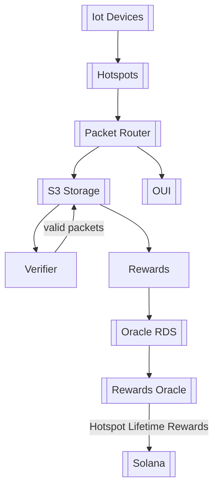
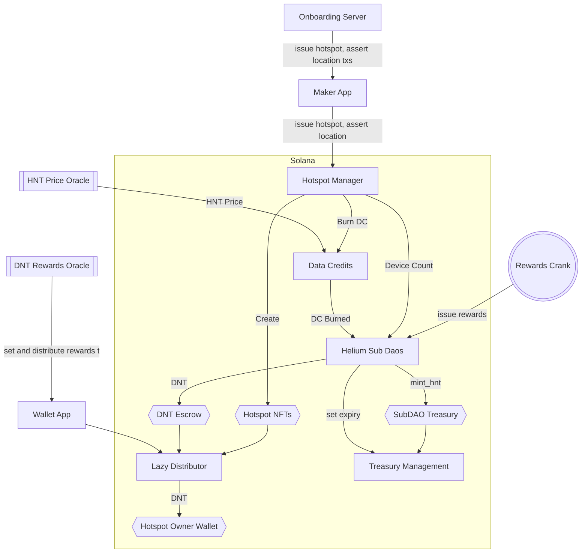

# Helium Program Library

A collection of solana programs used for Helium's Solana integration

## Overall Design (from migration, this is outdated but potentially still useful)


```mermaid
flowchart TD
  hotspot[[Hotspots]]
  ingest[[Packet Router]]
  s3[[S3 Storage]]
  verify[Verifier]
  rewards[Rewards]
  oracle_rds[[Oracle RDS]]
  rewards_oracle[[Rewards Oracle]]
  solana[[Solana]]
  oui[[OUI]]
  iot[[Iot Devices]]


  hotspot --> ingest
  ingest --> s3
  s3 --> verify
  verify --valid packets--> s3
  s3 --> rewards
  rewards --> oracle_rds
  oracle_rds --> rewards_oracle
  rewards_oracle --Hotspot Lifetime Rewards--> solana
  ingest --> oui
  iot --> hotspot
```


```mermaid
flowchart TD
  maker[Maker App]
  onboarding[Onboarding Server]
  crank(((Rewards Crank)))
  hnt_price_oracle[[HNT Price Oracle]]
  oracles[[DNT Rewards Oracle]]
  wallet_app[Wallet App]

  oracles --set and distribute rewards tx--> wallet_app
  wallet_app --> lazy_distributor
  subgraph Solana
    manager[Hotspot Manager]
    data_credits[Data Credits]
    dnt_rewards_escrow{{DNT Escrow}}
    hotspots{{Hotspot NFTs}}
    helium_sub_daos[Helium Sub Daos]
    lazy_distributor[Lazy Distributor]
    treasury_management[Treasury Management]
    user_wallet{{Hotspot Owner Wallet}}
    treasury{{SubDAO Treasury}}
  end

  data_credits --DC Burned--> helium_sub_daos

  onboarding --issue hotspot, assert location txs--> maker
  maker --issue hotspot, assert location--> manager

  hnt_price_oracle --HNT Price--> data_credits
  dnt_rewards_escrow --> lazy_distributor

  manager --Burn DC--> data_credits
  manager --Create--> hotspots
  manager --Device Count--> helium_sub_daos


  crank --issue rewards--> helium_sub_daos
  helium_sub_daos --DNT--> dnt_rewards_escrow
  helium_sub_daos --set expiry--> treasury_management
  helium_sub_daos --mint_hnt--> treasury
  treasury -->  treasury_management

  hotspots --> lazy_distributor
  lazy_distributor --DNT--> user_wallet

```


## Helium Sub Daos

Helium Sub Daos manages the daos and rewards structure of the Helium ecosystem. Other programs in the ecosystem
are expected to call out to helium sub daos to update rewardable actions, like issuing a new hotspot and burning
data credits

## Data Credits

Data credits manages the soulbound helium data credits, and how they can be burned to do several actions on the network. It also manages reading from an oracle to allow burning HNT for data credits

## Helium Entity Manager

Helium Entity Manager is responsible for issuing the various types of hotspots and rewardable entities that Helium supports (wifi, iot, mobile hotspots, mobile mappers, etc)

## Lazy Distributor

The lazy distributor is an oracle-powered token distributor that distributes tokens to holders
of particular NFTs as specified by oracles.

### Oracle Architecture

In order to facilitate setting rewards _and_ distributing rewards in a single Solana transaction,
I propose at the url specified in the oracle configuration, supporting `GET` and `POST`

#### GET Request

Request current rewards for the hotspot. Provide `?mint=...` query param with the hotspot mint.

Which should return

```
{
  "currentRewards": ...
}
```

#### POST Request

Sign transaction to set rewards and distribute

```
{
  transaction: ... // serialized transaction
}
```

Which should return

```
{
  transaction: ... // signed transaction
}
```

Before signing the transaction, the oracle should validate (1) that the transaction contains only

- `setCurrentRewards` instructions from other validators
- distribute instructions

and (2) that the amount set for `setCurrentRewards` for itself is correct.

#### Client Side

The client should:

- Submit requests to all oracles to get the current total rewards amount
- Form instructions to set rewards from all oracles using their specified rewards amount
- Submit a sign transaction request to all oracles sequentially
- Submit the signed transaction to Solana

## Local Setup

1. Make sure you're using Node 22+ and have pnpm installed via corepack

```
corepack enable
```

2. Install dependencies

```
pnpm install
```

3. Build all packages

```
pnpm run build
```

4. Start localnet

```
$: TESTING=true anchor localnet
```

5. Bootstrap localnet

```
$: . ./scripts/bootstrap-localnet.sh
```

6. Run tests against localnet

```
$: anchor test --provider.cluster localnet --skip-deploy --skip-local-validator --skip-build
```

If you run into trouble with your installation, run the following command to rebuild everything from scratch.

```
$: pnpm run clean && pnpm install && TESTING=true anchor build && pnpm run build
```

## Repo layout

```
programs/          On-chain Solana/Anchor programs (Rust).
packages/          TypeScript SDKs, React hooks, and backend services.
utils/             Rust services and CLIs that support the above.
migrations/        One-off migration scripts (run-once operational work).
migration-docker/  Dockerised GPG encryption for the migration keypair bundle.
tests/             Anchor integration tests for the programs.
.github/
  workflows/       CI pipelines (see "CI / deployment overview" below).
  actions/         Reusable composite actions used by the workflows.
docker-info.json   Registry of deployable services -> source paths.
```

Every leaf under `programs/`, `packages/`, and `utils/` has its own README that describes what the thing does and — if it's deployed — a table pointing at the k8s manifests in [helium-foundation-k8s](https://github.com/helium/helium-foundation-k8s).

## CI / deployment overview

Everything this repo publishes to the world runs through one of four GitHub Actions workflows:

| What changes | Triggered by | Workflow |
| --- | --- | --- |
| npm packages under `packages/*` | Merge to `develop` with a changeset | [`npm-publish.yaml`](.github/workflows/npm-publish.yaml) |
| Docker images for services | Git tag `docker-<env>-<service>-<version>` | [`docker-push.yaml`](.github/workflows/docker-push.yaml) |
| Solana programs on **mainnet** | Git tag `program-<name>-<version>` | [`release-program.yaml`](.github/workflows/release-program.yaml) |
| Solana programs on **devnet** | Merge to `develop` touching `programs/*`, or the `deploy-to-devnet` PR label | [`develop-release-program.yaml`](.github/workflows/develop-release-program.yaml) |
| Any program on devnet, manually | GitHub UI ("Run workflow") | [`manual-devnet-deploy.yaml`](.github/workflows/manual-devnet-deploy.yaml) |

Each is described in more detail below.

### Publishing npm packages

This repo uses [Changesets](https://github.com/changesets/changesets) for versioning and npm publishing.

1. When you make changes to packages that should be published, create a changeset:

   ```
   pnpm changeset
   ```

   This prompts you to pick the changed packages and whether the change is a patch, minor, or major bump. It writes a markdown file in `.changeset/` describing the change.

2. Commit the changeset file and merge to `develop`:

   ```
   git add .changeset/
   git commit -m "chore: add changeset"
   ```

3. When changesets are present on `develop`, the [NPM Publish workflow](.github/workflows/npm-publish.yaml) automatically opens a **"Version Packages"** PR that bumps versions and updates CHANGELOGs.

4. Merge the "Version Packages" PR to publish all changed packages to npm. Per-package git tags (e.g. `@helium/blockchain-api@0.11.17`) are created automatically.

`workspace:^` dependencies are automatically rewritten to real semver ranges during publish, so external consumers get the correct versions. Packages opt out of publishing by setting `"private": true` in their `package.json`.

### Deploying Docker services

Docker deployments are **decoupled from npm publishing** — you don't need to wait for an npm publish to push a service image. Every deployable service is registered in [`docker-info.json`](docker-info.json):

```jsonc
{
  "web":    { "blockchain-api": "./packages/blockchain-api", /* ... */ },
  "oracle": { "distributor-oracle": "./packages/distributor-oracle" },
  "data":   { "active-hotspot-oracle": "./utils/active-hotspot-oracle" }
}
```

- The **top-level key** (`web`, `oracle`, `data`) is the ECR environment. Each maps to its own AWS account & ECR registry:
  - `web` → `public.ecr.aws/v0j6k5v6/` (the shared Helium public ECR; most services live here and some are deployed into both the web and oracle k8s clusters from this one registry)
  - `oracle` → `public.ecr.aws/s2o4r1i6/` (used for `distributor-oracle`)
  - `data` → the data-cluster ECR
- The **second-level key** is the image name (what ECR tags it as).
- The **value** is the path to the folder containing the `Dockerfile`.

To release a new image:

```bash
git tag docker-web-blockchain-api-0.11.17
git push origin docker-web-blockchain-api-0.11.17
```

The tag format is strict: `docker-<env>-<service>-<version>`. The workflow parses the tag, looks up the source path in `docker-info.json`, logs into the matching ECR with the env-scoped AWS credentials, and pushes `<registry>/<service>:<version>`. Two build styles are supported:

- If the service's `Dockerfile` uses `turbo prune` (most JS services), the build context is the repo root and only the workspace packages it depends on are copied in.
- Otherwise (the Rust utils and `geocoder-service`), the build context is the service directory itself.

Once the image is in ECR, update the `image:` field in the matching manifest under [`helium-foundation-k8s`](https://github.com/helium/helium-foundation-k8s) and merge — ArgoCD picks the change up within a few minutes. A full catalogue of where each image is deployed lives in the service's own README.

### Releasing a program to mainnet

Mainnet program upgrades go through Squads (multisig) — this repo only builds the verifiable `.so`, stages a buffer, and proposes the upgrade transaction.

1. Bump the version in the program's `Cargo.toml`.
2. Push a tag matching `program-<program-name>-<version>`, e.g.:

   ```bash
   git tag program-helium-sub-daos-0.2.7
   git push origin program-helium-sub-daos-0.2.7
   ```

3. [`release-program.yaml`](.github/workflows/release-program.yaml) runs:
   - builds the program with `anchor build` and uploads the IDL as a GitHub release asset,
   - runs a **verifiable** Solana build (`solana-verify`) so the on-chain hash is reproducible,
   - deploys the `.so` and IDL to a buffer account owned by the multisig vault,
   - opens a Squads proposal to upgrade the program to the new buffer.
4. Sign and execute the Squads proposal.

### Releasing a program to devnet

Devnet uses a different lazy-signer seed (`devnethelium5` instead of the mainnet `nJWGUMOK`), so program binaries differ between networks. The workflows handle that automatically.

- **Automatic:** any push to `develop` that touches `programs/<name>/**` (outside `shared-utils/`) triggers [`develop-release-program.yaml`](.github/workflows/develop-release-program.yaml) for each changed program. On a PR into `develop`, add the `deploy-to-devnet` label to deploy preview-style.
- **Manual:** run [`manual-devnet-deploy.yaml`](.github/workflows/manual-devnet-deploy.yaml) from the Actions UI with the program name + branch. Same Squads-buffer + proposal flow as mainnet, but against the devnet multisig / RPC.

### Reusable composite actions

Each workflow above delegates to composite actions in [`.github/actions/`](.github/actions):

- `setup/`, `setup-ts/`, `setup-anchor/`, `setup-solana/` — tool installation.
- `build-anchor/` — `anchor build` (with optional `testing`/`devnet` lazy-signer seeds).
- `build-verified/` — verifiable build via `solana-verify` that produces a deterministic `.so`.
- `buffer-deploy/` — uploads the `.so` and IDL to buffer accounts owned by the multisig.

If you're adding a new program / service, you shouldn't need to change the workflows themselves — just add the program to `Anchor.toml` / `docker-info.json` and the tag pattern above will pick it up.

## Debugging tuktuk

Much of the scheduled on-chain work in this repo (epoch rollovers, rewards claims, proxy votes, DC auto-top-ups, mini-fanout distributions, Pyth price refreshes) runs as [tuktuk](https://github.com/helium/tuktuk) tasks in the `hpl-crons` task queue. When you get a **stale tasks** alert, work through the following.

### 1. List the active tasks

```sh
tuktuk -u <URL> task list --task-queue-name hpl-crons --active
```

- If the output is empty, there's nothing stuck — you can ignore the alert.
- If there are tasks, those are the stale ones. Pick one and figure out why it isn't running.

### 2. Reproduce the failure

To see *why* a task is failing, run it yourself with preflight disabled so the RPC returns a signature even though execution fails:

```sh
tuktuk -u <URL> task run --task-queue-name hpl-crons --id <ID> --skip-preflight
```

Then open the resulting signature in [Solana Explorer](https://explorer.solana.com/) and read the program logs.

> **Gotcha:** never run `task run` from a keypair that's already going to be present in the transaction for another reason. Every other crank-turner is some unrelated pubkey — if yours collides with a signer the task already needs, the tx will fail for spurious reasons that don't reflect why the task is stuck in production.

### 3. Common failure modes

**End-of-epoch crank isn't turning.**
Usually the tuktuk signer PDA that pays rent for ending the epoch has run out of SOL. Top it off, then re-run the stuck tasks.

**Automated rewards-claim failing for a specific position.**
Usually the user closed their delegation without also closing the automation, so the task keeps pointing at a non-existent account. It's almost always safe to `tuktuk task close` on these and move on.

**A burst of proxy votes is failing.**
Proxy voters run their own tuktuk signer PDA that pays the per-task tuktuk fee for every delegated vote. When that PDA drains, every proxy-vote task starts failing at once. Tuktuk logs include the signer for each task — find the broke signer(s), top them off, then restart `tuktuk-crank-turner`. That usually clears the backlog.

## Running packages locally

There are several packages that can be run as servers or applications:

- Start monitor

```
$: cd packages/monitor-service && pnpm dev
```

- Start oracle server

```
$: cd packages/distributor-oracle && pnpm dev
```

- Start blockchain API

```
$: cd packages/blockchain-api && pnpm dev
```
