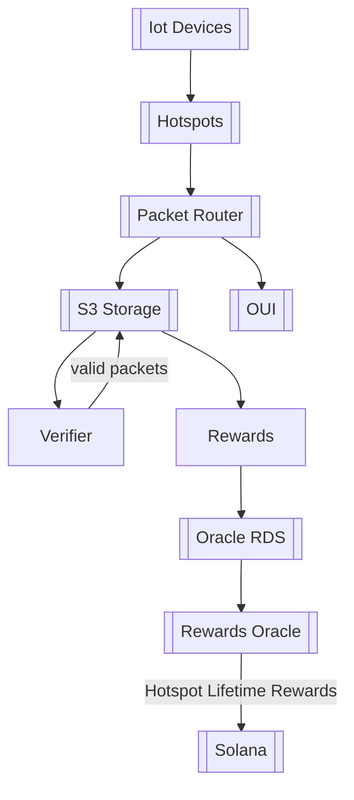
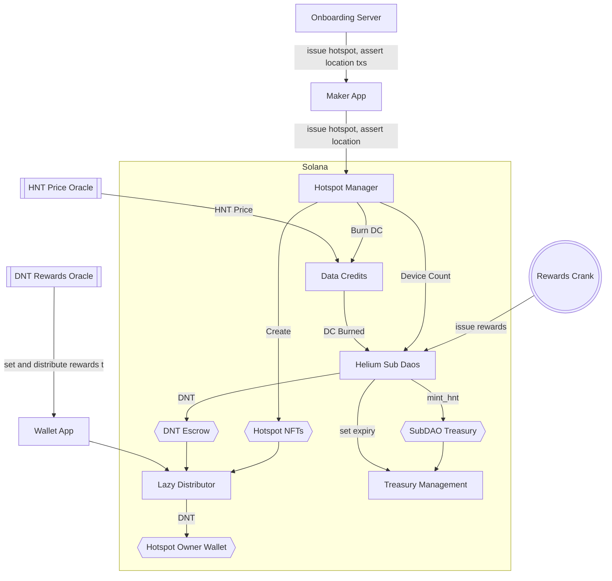
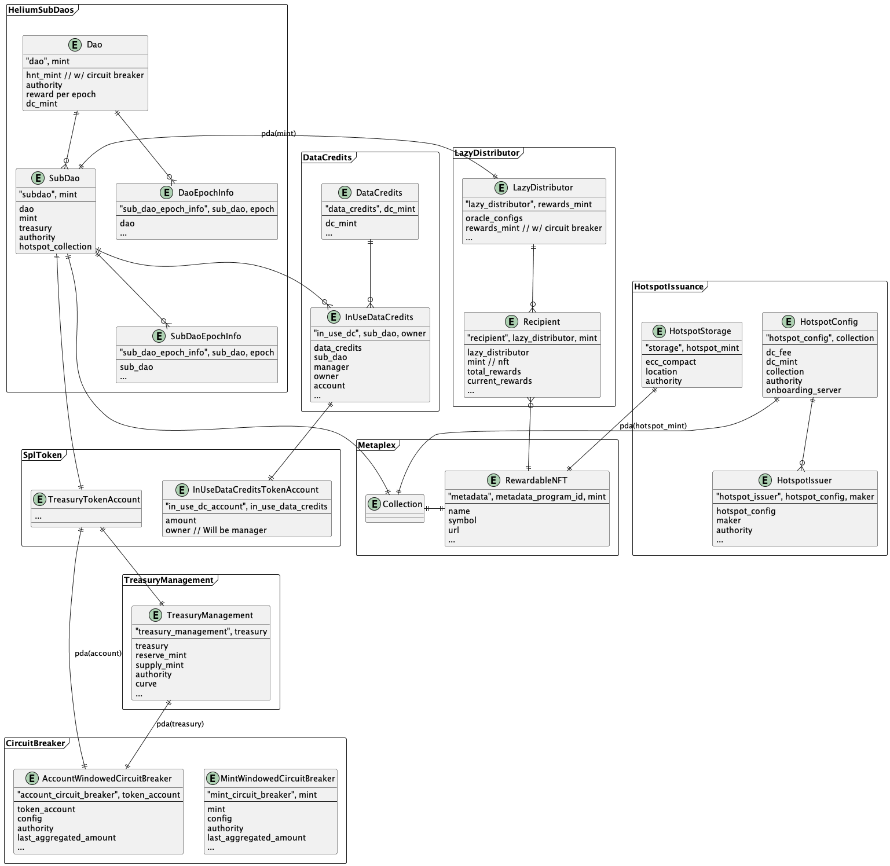

# Helium Program Library

A collection of solana programs used for Helium's Solana integration

## Overall Design (from migration, this is outdated but potentially still useful)


```mermaid
flowchart TD
  hotspot[[Hotspots]]
  ingest[[Packet Router]]
  s3[[S3 Storage]]
  verify[Verifier]
  rewards[Rewards]
  oracle_rds[[Oracle RDS]]
  rewards_oracle[[Rewards Oracle]]
  solana[[Solana]]
  oui[[OUI]]
  iot[[Iot Devices]]


  hotspot --> ingest
  ingest --> s3
  s3 --> verify
  verify --valid packets--> s3
  s3 --> rewards
  rewards --> oracle_rds
  oracle_rds --> rewards_oracle
  rewards_oracle --Hotspot Lifetime Rewards--> solana
  ingest --> oui
  iot --> hotspot
```


```mermaid
flowchart TD
  maker[Maker App]
  onboarding[Onboarding Server]
  crank(((Rewards Crank)))
  hnt_price_oracle[[HNT Price Oracle]]
  oracles[[DNT Rewards Oracle]]
  wallet_app[Wallet App]

  oracles --set and distribute rewards tx--> wallet_app
  wallet_app --> lazy_distributor
  subgraph Solana
    manager[Hotspot Manager]
    data_credits[Data Credits]
    dnt_rewards_escrow{{DNT Escrow}}
    hotspots{{Hotspot NFTs}}
    helium_sub_daos[Helium Sub Daos]
    lazy_distributor[Lazy Distributor]
    treasury_management[Treasury Management]
    user_wallet{{Hotspot Owner Wallet}}
    treasury{{SubDAO Treasury}}
  end

  data_credits --DC Burned--> helium_sub_daos

  onboarding --issue hotspot, assert location txs--> maker
  maker --issue hotspot, assert location--> manager

  hnt_price_oracle --HNT Price--> data_credits
  dnt_rewards_escrow --> lazy_distributor

  manager --Burn DC--> data_credits
  manager --Create--> hotspots
  manager --Device Count--> helium_sub_daos


  crank --issue rewards--> helium_sub_daos
  helium_sub_daos --DNT--> dnt_rewards_escrow
  helium_sub_daos --set expiry--> treasury_management
  helium_sub_daos --mint_hnt--> treasury
  treasury -->  treasury_management

  hotspots --> lazy_distributor
  lazy_distributor --DNT--> user_wallet

```



## Helium Sub Daos

Helium Sub Daos manages the daos and rewards structure of the Helium ecosystem. Other programs in the ecosystem
are expected to call out to helium sub daos to update rewardable actions, like issuing a new hotspot and burning
data credits

## Data Credits

Data credits manages the soulbound helium data credits, and how they can be burned to do several actions on the network. It also manages reading from an oracle to allow burning HNT for data credits

## Helium Entity Manager

Helium Entity Manager is responsible for issuing the various types of hotspots and rewardable entities that Helium supports (wifi, iot, mobile hotspots, mobile mappers, etc)

## Lazy Distributor

The lazy distributor is an oracle-powered token distributor that distributes tokens to holders
of particular NFTs as specified by oracles.

### Oracle Architecture

In order to facilitate setting rewards _and_ distributing rewards in a single Solana transaction,
I propose at the url specified in the oracle configuration, supporting `GET` and `POST`

#### GET Request

Request current rewards for the hotspot. Provide `?mint=...` query param with the hotspot mint.

Which should return

```
{
  "currentRewards": ...
}
```

#### POST Request

Sign transaction to set rewards and distribute

```
{
  transaction: ... // serialized transaction
}
```

Which should return

```
{
  transaction: ... // signed transaction
}
```

Before signing the transaction, the oracle should validate (1) that the transaction contains only

- `setCurrentRewards` instructions from other validators
- distribute instructions

and (2) that the amount set for `setCurrentRewards` for itself is correct.

#### Client Side

The client should:

- Submit requests to all oracles to get the current total rewards amount
- Form instructions to set rewards from all oracles using their specified rewards amount
- Submit a sign transaction request to all oracles sequentially
- Submit the signed transaction to Solana

## Local Setup

1. Make sure you're using Node 22+ and have pnpm installed via corepack

```
corepack enable
```

2. Install dependencies

```
pnpm install
```

3. Build all packages

```
pnpm run build
```

4. Start localnet

```
$: TESTING=true HELIUM_TEST_BUILD=true anchor localnet
```

5. Bootstrap localnet

```
$: . ./scripts/bootstrap-localnet.sh
```

6. Run tests against localnet

```
$: anchor test --provider.cluster localnet --skip-deploy --skip-local-validator --skip-build
```

If you run into trouble with your installation, run the following command to rebuild everything from scratch.

```
$: pnpm run clean && pnpm install && TESTING=true HELIUM_TEST_BUILD=true anchor build && pnpm run build
```

`TESTING` and `HELIUM_TEST_BUILD` travel together. A program refuses to compile when `TESTING`
is set without `HELIUM_TEST_BUILD`, so a mainnet build cannot pick up test values from a stray
environment variable.

Set both per command, as above, rather than `export`ing them. A shell that carries both gives
every later build in that shell test values, and the guard passes because the two agree.

The binary a cluster runs is never a local build. `release-program.yaml` builds it in CI from a
`program-*` tag via `.github/actions/build-verified`, which compiles in a container that
receives neither variable; `deploy-buffers` (with `write-program-buffer` and `write-idl-buffer`)
uploads that artifact with the Squads vault as its buffer authority, and the upgrade is a
multisig proposal. The guard's job is therefore the build that is _meant_ to be deployable
picking up `TESTING` on its own.

## Repo layout

```
programs/          On-chain Solana/Anchor programs (Rust).
packages/          TypeScript SDKs, React hooks, and backend services.
utils/             Rust services and CLIs that support the above.
migrations/        One-off migration scripts (run-once operational work).
migration-docker/  Dockerised GPG encryption for the migration keypair bundle.
tests/             Anchor integration tests for the programs.
.github/
  workflows/       CI pipelines (see "CI / deployment overview" below).
  actions/         Reusable composite actions used by the workflows.
docker-info.json   Registry of deployable services -> source paths.
```

Every leaf under `programs/`, `packages/`, and `utils/` has its own README that describes what the thing does and — if it's deployed — a table pointing at the k8s manifests in [helium-foundation-k8s](https://github.com/helium/helium-foundation-k8s).

## CI / deployment overview

Three things leave this repo: npm packages, service images, and Solana programs. Bots drive all three. A person reviews, merges, and votes on Squads. Every hand path below stays valid, and each is the fallback when a bot is down.

| Workflow                                                                         | Trigger                                                                                                                                            | What it does                                                                                                                                 |
| -------------------------------------------------------------------------------- | -------------------------------------------------------------------------------------------------------------------------------------------------- | -------------------------------------------------------------------------------------------------------------------------------------------- |
| [`tests.yaml`](.github/workflows/tests.yaml)                                     | Every PR, and push to `develop` or `master`                                                                                                        | Tests and lint, plus two release gates: **Release Declaration** (the backstop check) and **Program Version Bumps** (the missing-bump check). |
| [`changeset-bot.yaml`](.github/workflows/changeset-bot.yaml)                     | PR to `develop` or `master`; manual dispatch                                                                                                       | Writes the changeset and the program changeset a PR is missing.                                                                              |
| [`version-programs.yaml`](.github/workflows/version-programs.yaml)               | Push to `develop`; PR to `develop`; manual dispatch                                                                                                | Turns `.changeset-programs/` into `Cargo.toml` bumps and changelogs on the program release PR.                                               |
| [`npm-publish.yaml`](.github/workflows/npm-publish.yaml)                         | Push to `develop`                                                                                                                                  | Opens the "Version Packages" PR, and publishes to npm when that PR merges.                                                                   |
| [`promotion-pr.yaml`](.github/workflows/promotion-pr.yaml)                       | Push to `develop`; manual dispatch                                                                                                                 | Keeps one `develop` to `master` **Promotion PR** open while develop is ahead.                                                                |
| [`back-merge-pr.yaml`](.github/workflows/back-merge-pr.yaml)                     | Push to `master`; manual dispatch                                                                                                                  | Opens the `master` to `develop` back-merge PR after a hotfix.                                                                                |
| [`program-auto-tag.yaml`](.github/workflows/program-auto-tag.yaml)               | Push to `master`; manual dispatch                                                                                                                  | Creates `program-<name>-<version>` for every version on master that has no tag yet.                                                          |
| [`release-program.yaml`](.github/workflows/release-program.yaml)                 | Git tag `program-<name>-<version>`                                                                                                                 | Builds the program, uploads the IDL and the release hash, writes the buffers, and opens the Squads proposal.                                 |
| [`develop-release-program.yaml`](.github/workflows/develop-release-program.yaml) | Push to `develop` that changes a program's `src/`, `Cargo.toml` or `idls/`, or a workspace crate it depends on, or the `deploy-to-devnet` PR label | The same deploy against devnet. It creates no tag.                                                                                           |
| [`manual-devnet-deploy.yaml`](.github/workflows/manual-devnet-deploy.yaml)       | Manual dispatch                                                                                                                                    | One program to devnet from any branch.                                                                                                       |
| [`program-hash-check.yaml`](.github/workflows/program-hash-check.yaml)           | Daily at 13:17 UTC; manual dispatch                                                                                                                | Compares each mainnet program with the hash its newest release published.                                                                    |
| [`sweep-deployer-buffers.yaml`](.github/workflows/sweep-deployer-buffers.yaml)   | Weekly on Monday at 14:43 UTC; manual dispatch                                                                                                     | Closes the program and IDL buffers the deployer key still owns, and returns the rent.                                                        |
| [`service-auto-tag.yaml`](.github/workflows/service-auto-tag.yaml)               | Push to `develop`; manual dispatch                                                                                                                 | Pushes the next `docker-<env>-<service>-<version>` tag for each opted-in service that changed.                                               |
| [`docker-push.yaml`](.github/workflows/docker-push.yaml)                         | Git tag `docker-<env>-<service>-<version>`                                                                                                         | Builds the service image and pushes it to ECR.                                                                                               |

**Where a bot reports.** No bot sends a message off GitHub. A bot that needs a person writes on its own run: an annotation at the top of the run, and a line in the run summary. A run that must not stay green is red. Read them in the [Actions tab](../../actions), filtered by workflow: `release-program.yaml` for a deploy or a hand tag, `program-hash-check.yaml` for the daily check, `program-auto-tag.yaml` for a program that changed with no version bump.

### What you do in a pull request

Open the PR. The changeset bot adds the release notes it is missing:

- a changeset in `.changeset/` for each changed npm package;
- a program changeset in `.changeset-programs/` for each changed program.

Nothing reads the diff for meaning. Fixed rules pick every level and every line, in [`scripts/write-changesets.mjs`](scripts/write-changesets.mjs), whose unit tests are those rules:

- **npm level**: `patch` for each changed package. `@helium/idls` takes the level the IDL diff gives: `minor` when a program adds an instruction, an account, a type or a field; `minor` plus a "Possible breaking change: ..." line when one is removed or its type changed; `patch` otherwise. `@helium/idls` with no IDL diff at all — its own files changed and no program moved — is `patch`.
- **program level**: a program you changed takes that same IDL-diff hint. A program you changed only through a dependency takes `patch`, because it links the whole crate it depends on. The bot never writes `none`; a person sets it by hand.
- **text**: the PR title, with its `type(scope):` prefix stripped and the first letter capitalised. The program file adds a line per program that names the IDL change, or the reason for the level.
- **no release**: a path that matches `*.md`, `tests/`, `*.test.ts`, `.github/`, or `.scratch/` declares no release, so a PR that touches only those gets no file. That filter is `NO_RELEASE_PATTERNS` in [`scripts/changed-programs.mjs`](scripts/changed-programs.mjs).

The bot writes at most one new file in each directory, and it never edits a file that is already there. So to change what a release says, edit the file the bot wrote and push. Your edit stands, and no later run rewrites it.

The bot commits through the GitHub API with the [`api-commit`](.github/actions/api-commit) action, not `git push`. GitHub signs such a commit with its own key, so the bot's commit shows **Verified**. The commit names the head the run read; a branch that moved since then fails the commit, and the next run writes the files against the new head.

The bot skips drafts, its own commits, the release PR heads, the Promotion PR, and the back-merge PR. It also skips a PR from a fork, because a fork's token is read-only. For a fork PR, a maintainer pushes the file to the fork branch.

Write the files by hand when you prefer, or when the bot is down:

```bash
pnpm changeset
```

That prompts for the changed packages and the level, and writes a file in `.changeset/`. For a program, write the file yourself in [`.changeset-programs/`](.changeset-programs); its [README](.changeset-programs/README.md) gives the format and the levels.

The **Release Declaration** check in `tests.yaml` is the backstop. It fails the PR when a changed package or a changed program is named nowhere. It runs on drafts and on forks, and it does not care who wrote the file. Its failure text says: write a changeset by hand or re-run the bot job.

### Releasing npm packages

This repo uses [Changesets](https://github.com/changesets/changesets) for npm versioning and publishing. Programs carry no `package.json`, so they stay out of it.

1. Merge the PR with its changeset to `develop`.
2. `npm-publish.yaml` opens or updates the **"Version Packages"** PR, which bumps the versions and writes the changelogs.
3. Merge that PR to publish every changed package to npm. Per-package git tags (for example `@helium/blockchain-api@0.11.17`) are created automatically.

`workspace:^` dependencies are rewritten to real semver ranges during publish, so external consumers get the correct versions. A package opts out of publishing with `"private": true` in its `package.json`.

### Releasing a program to mainnet

A mainnet upgrade takes four steps. Nobody bumps a `Cargo.toml` and nobody pushes a `program-*` tag by hand. While `DRY_RUN` is true the bots write nothing, so bump and tag by hand as [Dry run, go-live, and rollback](#dry-run-go-live-and-rollback) describes.

**1. The program changeset.** It lands with your PR, as above.

**2. The program release PR.** A push to `develop` with program changesets present runs `version-programs.yaml`, which runs `scripts/version-programs.mjs` and opens or updates the **program release PR** from `program-release/develop`. Merging it bumps each `Cargo.toml`, prepends the entry to each `programs/<name>/CHANGELOG.md`, deletes the files it used, and runs `cargo update --workspace`. It creates no tag.

On that PR, the **New program versions are untagged** job of the same workflow checks that every version the PR bumps to is still free of a tag. Do not push commits to `program-release/develop`: the workflow force-moves that branch on every push to `develop`, so edit the changesets on `develop` instead.

**3. Promotion.** `promotion-pr.yaml` keeps one `develop` to `master` **Promotion PR** open while develop is ahead. Its body lists the programs a merge deploys with their changelog sections, the programs that changed with no bump, and the unversioned program changesets. It says nothing about npm or services, because promotion does nothing to either. The bot never merges and never approves.

The **Program Version Bumps** check gates that PR. For each program whose current version already has a tag, it diffs from that tag to HEAD and fails when the source changed. A tag is never moved and a version is never reused, so tagged source that changed would deploy under a version already on chain. Clear the failure with a program changeset and a new program release PR.

Merge the Promotion PR with a merge commit. Master takes merge commits only.

**Hotfix straight to master.** Add the program changeset in the hotfix branch and run the version script there:

```bash
node scripts/version-programs.mjs
```

Then merge the hotfix. `back-merge-pr.yaml` opens the `master` to `develop` back-merge PR, and a person merges it. Master ahead of develop blocks every later promotion, so merge it soon.

**4. The tag and the deploy.** On each push to master, `program-auto-tag.yaml` creates `program-<name>-<Cargo.toml version>` at the head of master for every program whose version has no tag. It is a state rule, so the next run heals a missed or failed one. A program with no earlier tag is skipped and logged.

The tag starts `release-program.yaml`, which:

- refuses the tag when its version differs from `programs/<name>/Cargo.toml` at the tagged commit, or when the commit is not an ancestor of `origin/master`;
- builds the IDL with `anchor idl build`;
- runs a verifiable `solana-verify` build;
- publishes the GitHub release with the IDL and `<name>.so.sha256`, the **release hash**, only after that build succeeds, from a job that runs no build scripts;
- writes the program and IDL buffers with the Squads vault as their authority;
- opens the Squads proposal to upgrade the program to the new buffer.

Then sign and execute the proposal in Squads. That step stays manual.

In the release workflow, the deployer key reaches only the jobs that write buffers and open the proposal. The jobs that run workspace JavaScript hold no key. The weekly sweep also holds the key.

Push a tag by hand when the tag bot is down:

```bash
git tag program-helium-sub-daos-0.2.7
git push origin program-helium-sub-daos-0.2.7
```

A tag is never deleted, moved, or reused. A version is never reused. To correct a release, release the next version.

### Re-running a failed program deploy

Re-run the failed workflow run. The [`plan-deploy`](.github/actions/plan-deploy) action holds the rules, and all three deploy workflows use it, so devnet behaves like mainnet:

- The on-chain program hash and the on-chain IDL both match the build: the run stops with success and writes nothing.
- Only the IDL changed: the run upgrades the program to the same bytes and sets the new IDL.
- The Squads vault already owns a buffer whose bytes match the build: the run reuses that buffer, so a re-run pays the write once.
- A pending proposal already names the reused program buffer, and its IDL buffer holds the build IDL: the run stops with success. Vote on the proposal that is open.
- An older pending proposal names a different buffer for the program: the run goes on, and prints an `Older pending proposal` notice annotation naming its index, plus the same line in the run summary, so the signers reject it. An execute of the older one after the newer would roll the program back.
- This run's own program buffer and IDL buffer are closed when the run fails or is cancelled before the vault takes them.
- A runner that dies before the authority transfer runs no close step, and the buffers stay with the deployer key. [`sweep-deployer-buffers.yaml`](.github/workflows/sweep-deployer-buffers.yaml) runs each week, closes the program buffers and IDL buffers the deployer key still owns, and returns the rent. It stops while a release runs.

IDL buffers are never reused. Each run that goes on writes a new one.

> **Run `helium-admin close-buffers` only when no upgrade proposal is pending.** It closes every buffer the vault owns, including the buffer a pending proposal names. That proposal then fails on execute, and the release has to run again.
>
> ```bash
> helium-admin close-buffers -u <rpc-url> --multisig <multisig> --programId <program-id>
> ```

### The daily hash check

`program-hash-check.yaml` compares each mainnet program with the release hash of its newest release. It takes no action, holds no state, and holds no deploy secret. Each program gets one of five results:

- **deployed**: the chain holds the newest release's binary. Silent.
- **pending**: the chain holds an older release of this repo. This is normal while a proposal waits for votes. Once the newest tag is more than 3 days old, the run prints a `Pending upgrade` warning annotation and a summary line, and stays green: the vote is still open.
- **unknown binary**: the chain holds a binary no release of this repo published. The run prints an `Unknown binary` error annotation and fails, so the check does not stay green while the question is open.
- **rolled back**: the chain holds an older release, and its last upgrade came after the newest tag. An older proposal executed after a newer release reads the same way. The run prints a `Rolled back` error annotation and fails, so a person looks at it.
- **error**: a release, chain or upgrade-time lookup failed, so the program has no result. The run prints a `Lookup error` annotation and fails. The other programs still get their results.

A program whose releases carry no `<name>.so.sha256` asset is skipped and named in the run summary. A `Skipped programs` warning annotation counts them. A program enters the check at its first release through this flow.

When a release is rejected in Squads and will never deploy, delete that release's `<name>.so.sha256` asset. The check then compares against the newest release that still has one, and stops reporting the rejected version as pending.

### Verifying a program locally

`release-program.yaml` builds every mainnet program through `solana-verify` and publishes the build's hash as the `<name>.so.sha256` release asset, the **release hash**. The daily hash check compares the chain with it. To repeat that build by hand, install [`solana-verify`](https://github.com/Ellipsis-Labs/solana-verifiable-build) and run it against the tagged commit:

```bash
solana-verify verify-from-repo -u https://api.mainnet-beta.solana.com \
  https://github.com/helium/helium-program-library \
  --program-id <program-id> \
  --library-name <library_name> \
  --commit-hash "$(git rev-list -n 1 program-<name>-<version>)"
```

The library name is the program directory name with underscores, for example `helium_sub_daos`. The program id is its entry in `[programs.localnet]` of [`Anchor.toml`](Anchor.toml).

Pass no `-b` image. Without one, `solana-verify` picks the build image from the Rust version in `Cargo.lock`, which is what CI does in [`build-verified`](.github/actions/build-verified). A pinned image gives a different hash.

Answer no when it asks to write verify data on chain, and do not pass `-y`.

The run builds the program in a container and prints the hash it got beside the hash the chain holds. To compare it with the release instead, read the `<name>.so.sha256` asset of the `program-<name>-<version>` release. Nothing is submitted anywhere: the build is local, and the release hash is the only published record.

### Deploying Docker services

Service images are decoupled from npm publishing. Every deployable service is registered in [`docker-info.json`](docker-info.json):

```jsonc
{
  "web": { "blockchain-api": "./packages/blockchain-api" /* ... */ },
  "oracle": { "distributor-oracle": "./packages/distributor-oracle" },
  "data": { "active-hotspot-oracle": "./utils/active-hotspot-oracle" },
  "autoTag": ["blockchain-api", "crons" /* ... */],
}
```

- The **top-level key** (`web`, `oracle`, `data`) is the ECR environment. Each maps to its own AWS account and ECR registry:
  - `web` to `public.ecr.aws/v0j6k5v6/` (the shared Helium public ECR; most services live here, and some are deployed into both the web and oracle k8s clusters from this one registry)
  - `oracle` to `public.ecr.aws/s2o4r1i6/` (used for `distributor-oracle`)
  - `data` to the data-cluster ECR
- The **second-level key** is the image name (what ECR tags it as).
- The **value** is the path to the folder that holds the `Dockerfile`.
- **`autoTag`** is the opt-in list for the tag bot. Add the service's image name to it to have tags pushed for you. Leave it out to tag that service by hand.

On each push to develop, `service-auto-tag.yaml` pushes `docker-<env>-<service>-<next patch>` for each service in `autoTag` that changed since its last tag. "Changed" means its own path changed; for a service whose `Dockerfile` uses `turbo prune`, a workspace dependency counts too. "Last" is the highest version of that service anywhere in the repo, so the bot continues from a hand tag and never takes a version a branch already used.

Tag a service by hand for a hotfix, a minor, or a major:

```bash
git tag docker-web-blockchain-api-0.11.17
git push origin docker-web-blockchain-api-0.11.17
```

The tag format is strict: `docker-<env>-<service>-<version>`. `docker-push.yaml` parses the tag, looks the source path up in `docker-info.json`, logs into the matching ECR with the env-scoped AWS credentials, and pushes `<registry>/<service>:<version>`. Two build styles are supported:

- If the service's `Dockerfile` uses `turbo prune` (most JS services), the build context is the repo root, and only the workspace packages it depends on are copied in.
- Otherwise (the Rust utils and `geocoder-service`), the build context is the service directory itself.

**A tag makes an image and deploys nothing.** The k8s bump stays manual: update the `image:` field in the matching manifest under [`helium-foundation-k8s`](https://github.com/helium/helium-foundation-k8s) and merge. ArgoCD picks the change up within a few minutes. A full catalogue of where each image is deployed lives in the service's own README.

### Dry run, go-live, and rollback

Each bot workflow starts with `env: DRY_RUN: true`. In dry run the bot writes what it would do to the run summary, and writes nothing outside the runner. A `workflow_dispatch` run overrides the flag with its `dry_run` input, for one run.

A bot goes live on a **shadow match**: the run summaries say what it would have done, a person confirms that matches what was done by hand, and a one-line PR sets `DRY_RUN: false`. The bar per bot is the changeset bot over 10 PRs, service auto-tag over 3 image releases, the program release PR over 1 version, the Promotion PR bot over 1 cycle, and the tag bot over 1 promotion.

The backstop check and the missing-bump check have no flag. They start as non-required checks and become required at their bot's go-live.

The deploy workflows have no dry run. Devnet is their rehearsal.

To roll a bot back, disable the workflow in the Actions UI, then revert its PR.

### Reusable composite actions

Each workflow above delegates to composite actions in [`.github/actions/`](.github/actions):

- `setup/`, `setup-ts/`, `setup-anchor/`, `setup-solana/`: tool installation.
- `build-anchor/`: `anchor build` (with optional `testing` and `devnet` lazy-signer seeds).
- `build-program-idl/`, `build-idls/`: IDL builds without a full SBF compile.
- `build-verified/`: verifiable build through `solana-verify` that produces a deterministic `.so`.
- `install-solana-verify/`: the one `solana-verify` pin. The release hash, the deploy skip and the daily hash check use it.
- `plan-deploy/`: the deploy re-run rules, in front of the two buffer writes. It takes no keypair.
- `deploy-buffers/`: the two buffer writes that `plan-deploy` asks for.
- `write-program-buffer/`, `write-idl-buffer/`: upload the `.so` and the IDL to buffer accounts owned by the multisig. Vendored from `solana-foundation/github-actions`; the source SHA is at the top of each file.
- `idl-diff/`: the IDL change the changeset bot reads.
- `api-commit/`: the commit the changeset bot and the program release PR make, through the GitHub API, so it shows Verified.

To add a program or a service, you should not need to touch the workflows. Add the program to `Anchor.toml`, or the service to `docker-info.json`, and the rules above pick it up.

### Releasing a program to devnet

Devnet uses a different lazy-signer seed (`devnethelium5` in place of the mainnet `nJWGUMOK`), so program binaries differ between networks. The workflows handle that.

- **Automatic:** a push to `develop` that changes a program runs `develop-release-program.yaml` for that program and for every program that depends on it. On a PR into `develop`, add the `deploy-to-devnet` label to deploy preview-style.
- **Manual:** run `manual-devnet-deploy.yaml` from the Actions UI with the program name and the branch.

Devnet creates no tag and no version. The run summary is the record: it prints each deployed program with its `Cargo.toml` version and the commit. The deploy itself follows the same re-run rules and the same Squads-buffer and proposal flow as mainnet, against the devnet multisig and RPC.

## Debugging tuktuk

Much of the scheduled on-chain work in this repo (epoch rollovers, rewards claims, proxy votes, DC auto-top-ups, mini-fanout distributions, Pyth price refreshes) runs as [tuktuk](https://github.com/helium/tuktuk) tasks in the `hpl-crons` task queue. When you get a **stale tasks** alert, work through the following.

### 1. List the active tasks

```sh
tuktuk -u <URL> task list --task-queue-name hpl-crons --active
```

- If the output is empty, there's nothing stuck — you can ignore the alert.
- If there are tasks, those are the stale ones. Pick one and figure out why it isn't running.

### 2. Reproduce the failure

To see _why_ a task is failing, run it yourself with preflight disabled so the RPC returns a signature even though execution fails:

```sh
tuktuk -u <URL> task run --task-queue-name hpl-crons --id <ID> --skip-preflight
```

Then open the resulting signature in [Solana Explorer](https://explorer.solana.com/) and read the program logs.

> **Gotcha:** never run `task run` from a keypair that's already going to be present in the transaction for another reason. Every other crank-turner is some unrelated pubkey — if yours collides with a signer the task already needs, the tx will fail for spurious reasons that don't reflect why the task is stuck in production.

### 3. Common failure modes

**End-of-epoch crank isn't turning.**
Usually the tuktuk signer PDA that pays rent for ending the epoch has run out of SOL. Top it off, then re-run the stuck tasks.

**Automated rewards-claim failing for a specific position.**
Usually the user closed their delegation without also closing the automation, so the task keeps pointing at a non-existent account. It's almost always safe to `tuktuk task close` on these and move on.

**A burst of proxy votes is failing.**
Proxy voters run their own tuktuk signer PDA that pays the per-task tuktuk fee for every delegated vote. When that PDA drains, every proxy-vote task starts failing at once. Tuktuk logs include the signer for each task — find the broke signer(s), top them off, then restart `tuktuk-crank-turner`. That usually clears the backlog.

## Running packages locally

There are several packages that can be run as servers or applications:

- Start monitor

```
$: cd packages/monitor-service && pnpm dev
```

- Start oracle server

```
$: cd packages/distributor-oracle && pnpm dev
```

- Start blockchain API

```
$: cd packages/blockchain-api && pnpm dev
```
